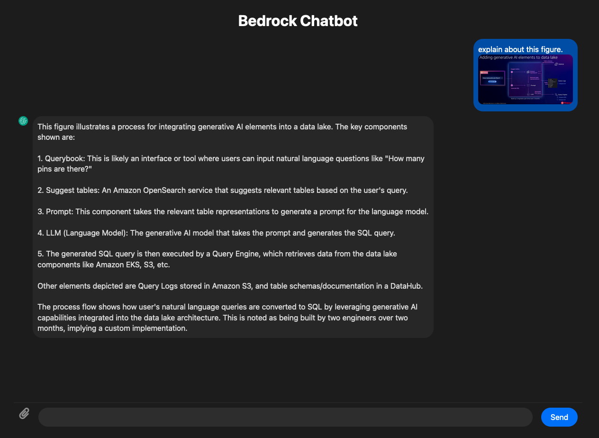

# Bedrock Chatbot Apps (NextJS ver.)

## Overview

Chatbot Apps JS is a JavaScript project designed to create and manage various chatbot applications. This project leverages modern web technologies and a rich ecosystem of Node.js packages to build, test, and deploy chatbot functionalities.



## Project Structure

The project structure is organized as follows:

```
chatbot-apps-js/
├── node_modules/          # Contains all the Node.js dependencies
├── src/                   # Source code for the chatbot applications
├── public/                # Static files for the frontend
├── tests/                 # Test cases for the application
├── .eslintrc.json         # ESLint configuration file
├── .gitignore             # Git ignore file
├── package.json           # NPM package configuration file
├── package-lock.json      # NPM package lock file
├── README.md              # Project documentation
└── ...
```

## Prerequisites

### Node.js

Ensure you have Node.js installed. The recommended version is specified in the `package.json` file under the `engines` field.

To check your Node.js version, run:

```bash
node -v
```

### npm

npm (Node Package Manager) is required to manage the dependencies. To check your npm version, run:

```bash
npm -v
```

## Installation

To install the necessary dependencies, run the following command:

```bash
npm install
```

## Usage

### Development Server

To start the development server, run:

```bash
npm start
```

This will start the application on `http://localhost:3000`.

### Building the Project

To build the project for production, run:

```bash
npm run build
```

The built files will be output to the `build` directory.

### Running Tests

To execute the test suite, run:

```bash
npm test
```

This will run all tests defined in the `tests` directory.

