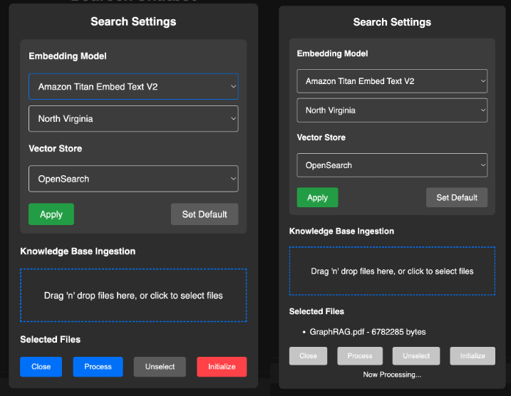

# Bedrock Chatbot Apps (NextJS ver.)

## Overview

This is a Next.js-based web frontend application for a chatbot that leverages the Bedrock Converse API for model invocation. The application includes several key features:

### Basic Features
- **Next.js Web Frontend**: Built using the powerful Next.js framework.
        
- **Bedrock Converse API**: Utilizes the Bedrock Converse API for chatbot model invocation.

### Additional Features
- **Multi-modal Chat**: Supports multimodal interactions (File upload / Clipboard).
        
- **Environment Configuration**: Easy setup and configuration of the environment.
    - Chat Mode Selection : Normal / RAG / Web Search / Auto (Work In progress)
- **In-Memory Chat History**: Maintains chat history in memory to preserve the chat context.
- **RAG (Retrieval-Augmented Generation)**: Combines the LLM with an external knowledge base.
    - Ingestion of Knowledge Base (PDF)
           
    - Chat with RAG
           
- **Web Search**: Delivers real-time, factual results with a web search retriever.        
           


## File Structure

The project is organized as follows:

```
chatbot-apps-js/
├── app/
│   ├── page.tsx
│   ├── ...
├── components/ 
│   ├── ...
├── hooks/
│   ├── ...
├── pages/
│   ├── ...
├── utils/
│   ├── ...
├── public/
│   ├── ...
├── py-backend/
│   ├── app/
│   │   ├── app.py
│   │   ├── ...
│   │   ├── libs/
│   │   │   ├── ...
│   │   ├── ...
├── package.json
├── README.md
└── SETUP.md
```

- `app/page.tsx` : This file is the main entry point of the application. It handles the rendering of the main chat interface and incorporates various components and hooks.

- `app/*.css` : These CSS modules provide styling for the settings popup and chat interface respectively.

- `components/*`: This directory contains reusable React components used throughout the application.

- `hooks/*` : Custom hooks used to manage state and side effects in the application.

- `pages/*` : Next.js pages directory for defining the application’s routes (defines an API endpoint).

- `utils/*` : Utility functions and helpers used across the application.

- `py-backend/app/app.py` : The main entry point for the FastAPI backend, handling API requests and routing.

- `py-backend/app/libs/` : Contains custom helper libraries for backend services.


## Getting Started

To get started with the project, please refer to the `SETUP.md` file for detailed instructions on setting up your environment and running the application.

