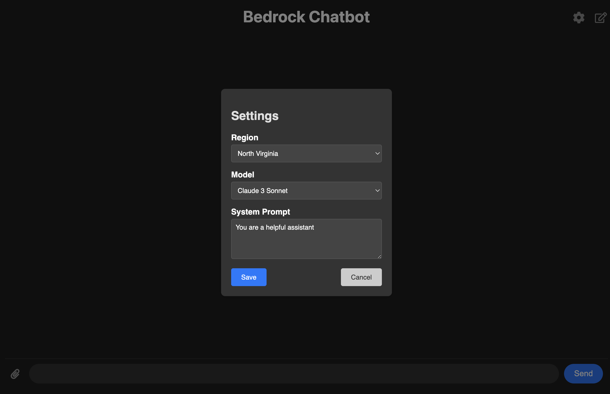

# Setup Guide

This document provides a step-by-step guide to setting up the Next.js Chatbot Application.

## Prerequisites

Ensure you have the following installed on your machine:
- Node.js (version 14.x or later)
- npm (version 6.x or later)

## Installation

1. **Clone the Repository**

```bash
git clone https://github.com/your-username/chatbot-apps-js.git
cd chatbot-apps-js
```

2. **Install Dependencies**

Navigate to the project directory and run the following command to install all necessary dependencies:
```bash
npm install
```


## Configuration

Verify that the model access permissions granted to the connected AWS IAM User or Role match the configuration set in the Settings.




## Running the Application

To start the development server, run:

```bash
npm run dev
```

Open your browser and navigate to http://localhost:3000 to see the application in action.


## Building for Production 

To create an optimized production build, run:

```bash
npm run build
```

Then, start the production server with:
```bash
npm start
```

## Troubleshooting 

If you encounter any issues, please check the following:

	•	Ensure all dependencies are installed correctly.
	•	Verify your environment variables are set up properly.
